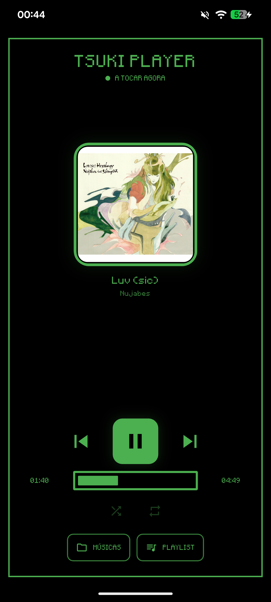
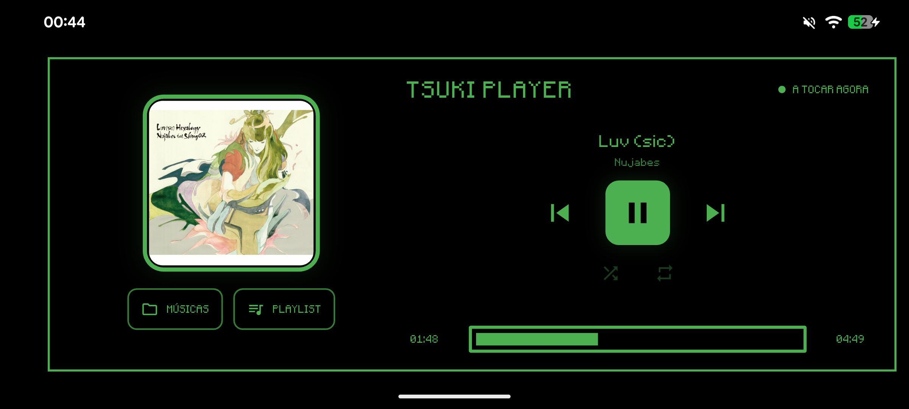
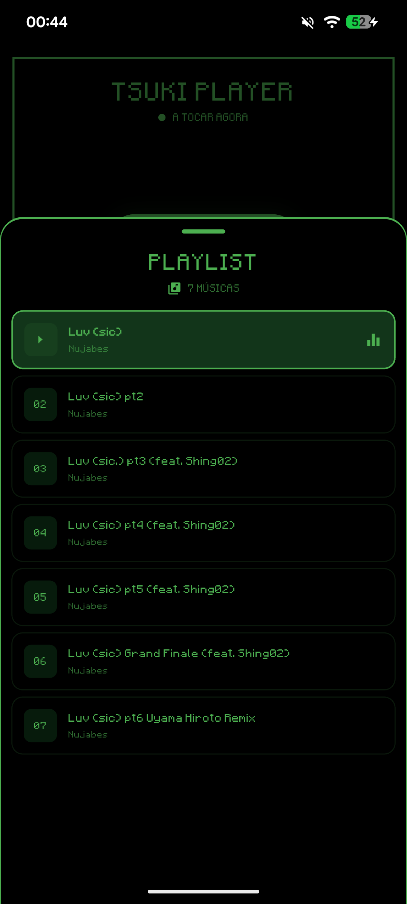
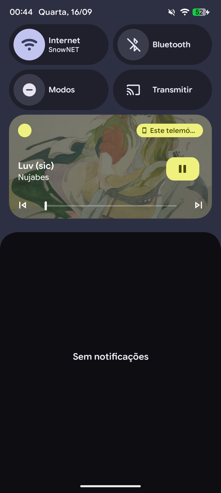

# 🎵 Tsuki Player

A retro MP3 player for Android and desktop, built with Flutter.

Tsuki Player is inspired by the compact MP3 players and LCD interfaces of the
2000s: black backgrounds, green text, pixel-style typography and a simple
music-focused interface.

## ✨ Features

- ▶️ Play / pause
- ⏮️ Previous and ⏭️ next track
- 🔀 Shuffle
- 🔁 Repeat
- 📟 Retro LCD-style seek bar
- 🖼️ Embedded album artwork and metadata
- 🔔 Android media notification and lock-screen controls
- 📱 Responsive portrait layout
- ↔️ Responsive landscape layout
- 📲 Designed to work on phones and larger screens

## 🛠️ Built with

- [Flutter](https://flutter.dev/)
- [Dart](https://dart.dev/)
- [just_audio](https://pub.dev/packages/just_audio)
- [audio_service](https://pub.dev/packages/audio_service)
- [media_metadata](https://pub.dev/packages/media_metadata)
- [SAF](https://pub.dev/packages/saf)

## 🚀 Getting started

### Requirements

- Flutter SDK
- Android SDK for Android builds
- A physical Android device or emulator for Android testing

### Run

```bash
flutter pub get
flutter run
```

### Build a release APK

```bash
flutter build apk --release
```

The repository does not include production signing keys. Configure your own
Android release signing setup before distributing a signed build.

## 🎵 Music files

Tsuki Player reads MP3 files selected from a folder on the device.

No commercial music files are included in this repository. Use music that you
own or have permission to use when testing or distributing the app.

## 🔐 Secrets

Do not commit API keys, passwords, tokens, signing keys, `.env` files or other
private credentials.

## 📸 Screenshots

### Player



### Landscape



### Playlist



### Android Media Controls



## 📁 Project structure

```text
lib/
├── models/       # Data models
├── player/       # Audio service / media session
├── screens/      # Player UI
└── services/     # Music and storage logic

assets/
└── fonts/        # Minecraftia font
```

## 📌 Project status

Tsuki Player is an ongoing personal/open-source project.

## 📄 License

Released under the MIT License. See [LICENSE](LICENSE).
